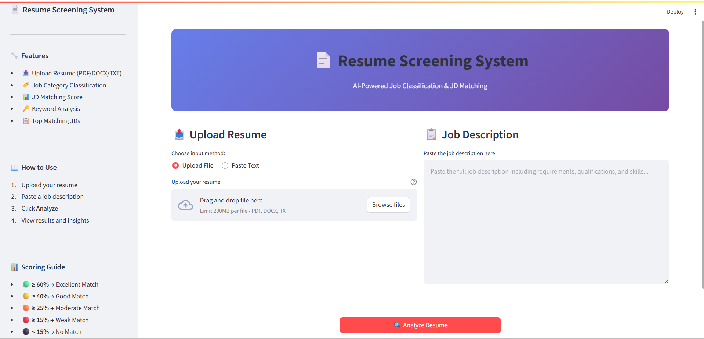
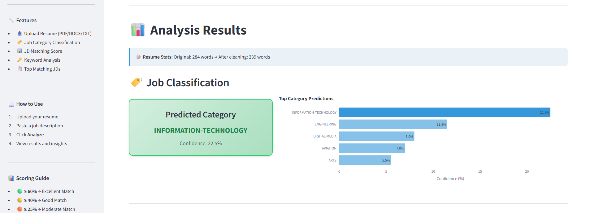
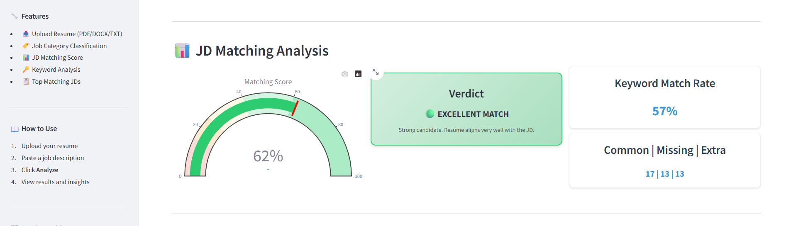
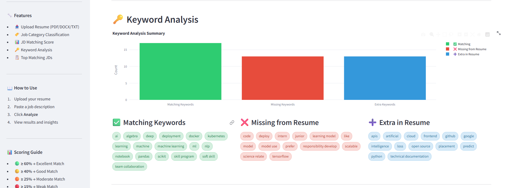

# 📄 Resume Screening System

AI-powered Resume Screening System that performs **Job Classification** and **JD Matching** using NLP and Machine Learning.

## 🚀 Features

- **Resume Upload**: Support for PDF, DOCX, and TXT files and Automatic text extraction
- **Job Classification**: Predicts job category using trained ML model (TF-IDF + Classifier)
- **JD Matching**: Computes cosine similarity between resume and job description
- **Keyword Analysis**: Identifies matching, missing, and extra keywords
- **Top Job Matches**: Finds best matching jobs from database of 19,000+ JDs and displays top 5 most relevant jobs
- **Interactive Dashboard**: Built with Streamlit and contains visualizations using Plotly (charts, gauges, metrics)

## 🛠️ Tech Stack

- **Programming Language**: Python
- **ML/NLP**: scikit-learn, NLTK, TF-IDF Vectorization
- **Frontend**: Streamlit
- **Visualization**: Plotly
- **Training**: Kaggle (GPU)
- **Deployment**: Streamlit Local

## 📊 Model Performance

| Model | Accuracy | F1 (Weighted) | F1 (Macro) |
|-------|----------|---------------|------------|
| Random Forest | 73.04% | 71.22% | 67.72% |

## 📁 Project Structure

```text
resume-screening-system/
├── models/                          # Trained model artifacts
│
├── data/                            # Sample data
│
├── app/
│   ├── streamlit_app.py             # Main Streamlit application
│   |
│   ├── assets/                      # UI assets
│   │   ├── style.css                # Custom CSS
│   │   └── screenshots/             # 📸 Screenshots
│   │       ├── home.png
│   │       ├── classification.png
│   │       ├── jd_matching_score.png
│   │       └── keyword_analysis.png
│   |
│   └── utils/                       # Utility modules
│       ├── preprocessor.py          # Text preprocessing
│       ├── resume_parser.py         # PDF/DOCX parser
│       ├── classifier.py            # Job classification
│       └── matcher.py               # JD matching
│
├── requirements.txt
├── test_model.py
├── test_matching.py
├── README.md
└── .gitignore
```

## 🏃 How to Run

```bash
# Clone repo
git clone <https://github.com/Arjav-Jain22/resume-screening-system.git>
cd resume-screening-system

# Create virtual environment
python3 -m venv venv
source venv/bin/activate

# Install dependencies
pip install -r requirements.txt

# Run app
streamlit run app/streamlit_app.py
```

## 📊 How It Works

1️⃣ Resume Processing

- Extract text from uploaded file
- Clean and preprocess text (stopwords removal, normalization)

2️⃣ Job Classification

- Convert text → TF-IDF vectors
- Multi-class Classification
- Predict job category using trained ML model

3️⃣ JD Matching

- Convert resume + JD into same vector space
- Compute cosine similarity score

4️⃣ Keyword Analysis

- Identify:
    - Common keywords
    - Missing keywords
    - Extra keywords

5️⃣ Job Recommendation

- Compare resume with dataset of job descriptions
- Return top matching job roles

## 📈 Datasets Used

- Resume Dataset by Snehaan Bhawal (Kaggle) - Job Classification
- Job Postings Dataset by Akshat Jain (Kaggle) - JD Matching

## 🧪 Testing

Run these scripts to verify models:

- python test_model.py
- python test_matching.py

## 📝 Scoring Guide

- Score	  Verdict
- ≥ 60%	  🟢 Excellent Match
- ≥ 40%	  🟡 Good Match
- ≥ 25%	  🟠 Moderate Match
- ≥ 15%	  🔴 Weak Match
- < 15%	  ⚫ No Match

## 📸 Screenshots

### 🏠 Home Interface

<p align="center">
  
</p>

---

### 🏷️ Job Classification

<p align="center">
  
</p>

---

### 📊 JD Matching Score

<p align="center">
  
</p>

---

### 🔑 Keyword Analysis

<p align="center">
  
</p>

## 👨‍💻 Author

Arjav Jain
B.Tech AI & DS Student